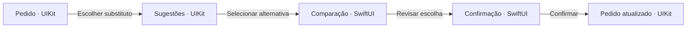
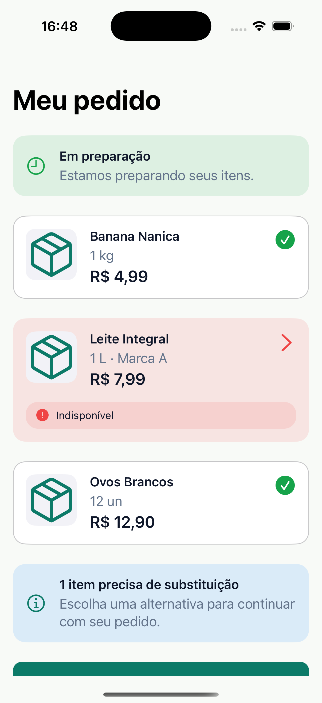
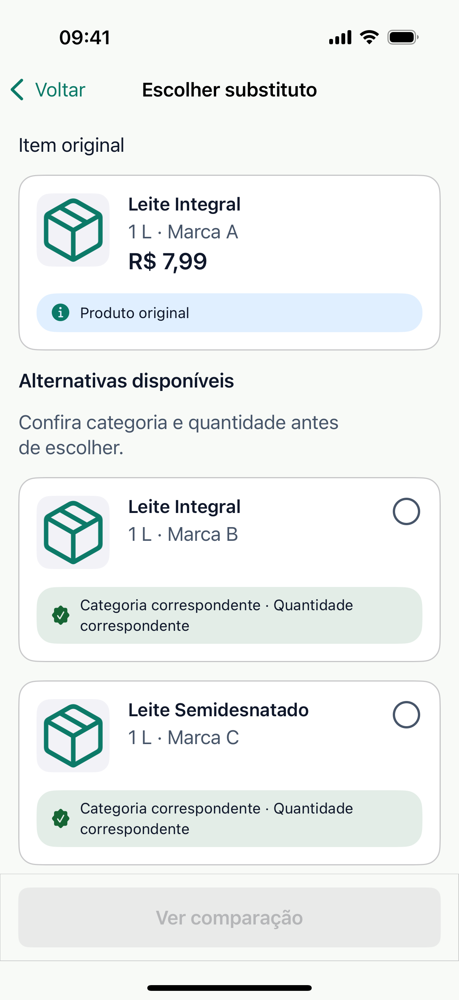
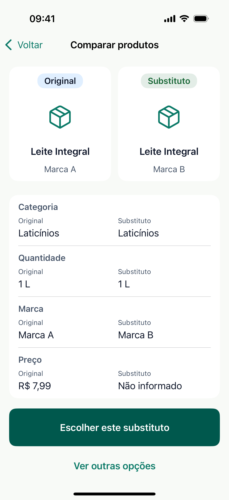
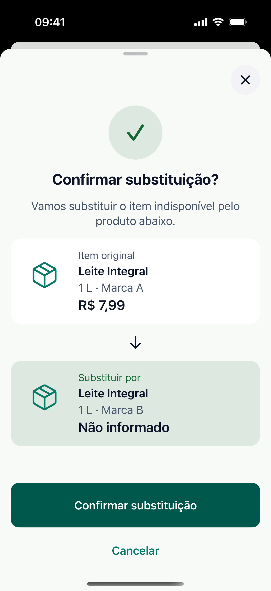
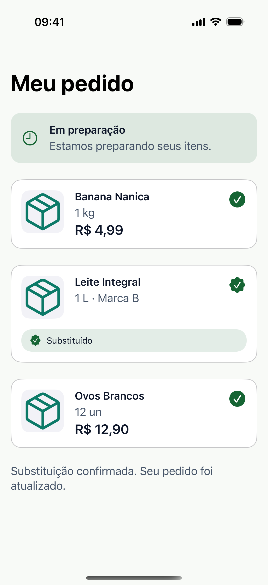
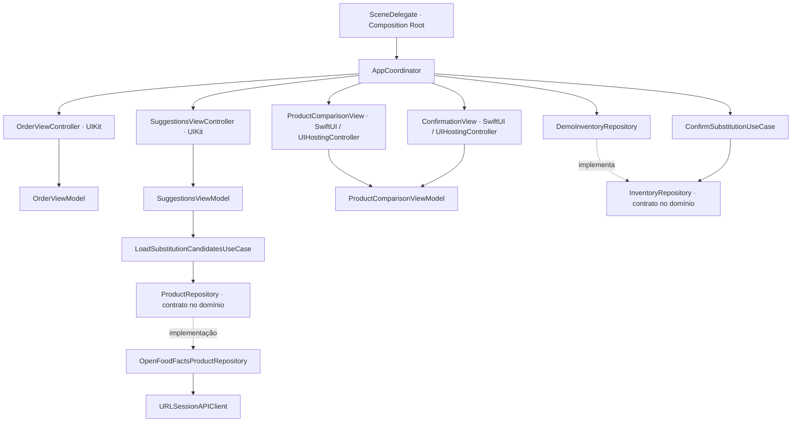
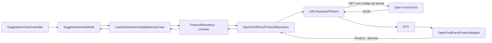

# Substi iOS

**Uma experiência demonstrativa para escolher um substituto quando um produto do pedido fica indisponível.** O app consulta o catálogo público Open Food Facts, permite comparar alternativas e atualiza um pedido mantido localmente.

| Plataforma | Linguagem | Interface | Arquitetura |
| --- | --- | --- | --- |
| iOS 16+ | Swift 6.1, Swift 6 Language Mode | UIKit + SwiftUI | MVVM-C |

## Sobre o projeto

Durante a separação de uma compra de mercado, um produto escolhido pode ficar indisponível. A pessoa precisa tomar uma nova decisão depois de já ter concluído sua escolha. O Substi explora como reduzir esse esforço apresentando alternativas e deixando visíveis as informações disponíveis para comparação.

É um recorte de produto demonstrativo, não uma afirmação sobre funcionalidades existentes ou ausentes no iFood. O pedido e a disponibilidade de estoque são locais; o catálogo público não representa o inventário de uma loja.

```text
Pedido → produto indisponível → sugestões → comparação → confirmação → pedido atualizado
```

## Jornada da aplicação

O fluxo percorre as quatro telas e retorna ao pedido com o item substituído:



Na abertura, uma Launch Screen estática mantém a identidade visual durante a inicialização do iOS. Em seguida, uma animação curta de marca conduz ao pedido e respeita Reduce Motion. A abertura não simula carregamento de rede: a consulta real começa quando a pessoa solicita sugestões.

### Capturas do aplicativo

Capturas reais das cinco etapas, obtidas durante a jornada automatizada no iPhone 16 Pro Simulator (iOS 18.6). Os arquivos `docs/assets/*-reference.png` são mockups de referência, não screenshots do app. O teste usa catálogo determinístico para reproduzir as mesmas telas; a execução normal foi validada separadamente com a API real e carregou os três candidatos configurados sem falhas.

| Meu pedido · UIKit | Sugestões · UIKit |
| --- | --- |
|  |  |

| Comparação · SwiftUI | Confirmação · SwiftUI |
| --- | --- |
|  |  |

Após confirmar, o fluxo retorna ao pedido atualizado:



## Arquitetura

O app usa **MVVM-C em escala proporcional ao fluxo**: ViewControllers UIKit e views SwiftUI exibem o estado preparado pelas ViewModels; o `AppCoordinator` navega entre as telas; contratos de repositório definem limites entre a aplicação e as fontes de dados. O `SceneDelegate` atua como composition root e faz a injeção manual das dependências.



O domínio é um pacote local Swift Package Manager (`SubstiDomain`), sem dependência de UIKit ou SwiftUI. As pastas `App`, `Application`, `Data`, `Presentation`, `DesignSystem` e `Observability` ficam no target do app. Extrair todas as camadas em pacotes separados aumentaria a configuração e a superfície de APIs sem uma necessidade atual.

### Responsabilidades

| Parte | Papel no Substi |
| --- | --- |
| View / ViewController | Renderiza dados de apresentação e encaminha ações da pessoa. |
| ViewModel | Mantém e transforma o estado consumido pela tela. |
| Use Case | Coordena uma operação da aplicação: carregar candidatos com falhas parciais e ranking, ou confirmar e persistir uma substituição. |
| Repository | Separa o pedido local e o catálogo remoto das partes que consomem os dados. |
| Coordinator | Constrói telas e conduz a navegação UIKit e SwiftUI. |
| Composition Root | Cria implementações concretas e injeta dependências no início da cena. |

### Por que MVVM-C

O fluxo atravessa UIKit e SwiftUI e precisa atualizar o pedido após a confirmação. O Coordinator mantém as transições fora das telas, enquanto as ViewModels preparam estado para apresentação. MVC também poderia atender uma versão menor, mas concentraria mais coordenação no controller; VIPER acrescentaria tipos e montagem para pouco benefício neste escopo. MVVM-C oferece um equilíbrio entre navegação explícita, testabilidade e custo de estrutura. A decisão e seus trade-offs estão em [ADR-001](docs/project/adr/ADR-001-mvvm-c.md).

## Dados e integração com API

### Caminho dos dados de catálogo



O endpoint consultado é `GET /api/v3/product/{barcode}`, solicitando nome, categoria, marca e quantidade. O cliente envia `User-Agent`, verifica status HTTP e erros de transporte; o Mapper rejeita respostas sem código ou nome válidos e mantém campos opcionais ausentes como `nil`.

### Catálogo público e pedido demonstrativo

| Fonte | O que fornece no app | Limite conhecido |
| --- | --- | --- |
| Open Food Facts | Nome, categoria, marca e quantidade do produto identificado pelo código de barras. | Dados comunitários podem estar ausentes, incompletos ou indisponíveis; não informam estoque da loja. Imagem e preço do substituto não são obtidos neste fluxo. |
| `DemoInventoryRepository` | Pedido inicial, produto indisponível e códigos de barras candidatos. Mantém a substituição confirmada em memória. | Não é um backend, não persiste após encerrar o app e não consulta estoque comercial. |

No uso normal, as sugestões vêm da API real. O catálogo determinístico `DemoCatalogProductRepository` só é selecionado em build `DEBUG` com o argumento `--uitest-demo-catalog`, para tornar a jornada de UI repetível sem Internet. Isso não substitui a API no fluxo normal.

O ranking é uma heurística determinística: prioriza igualdade textual normalizada de categoria, depois de quantidade; em empate, preserva a ordem recebida. Não estima porcentagens, não valida adequação com usuários e não usa ML. Mais detalhes em [requisitos do produto](docs/product-requirements.md).

## UIKit, SwiftUI e Design System

UIKit implementa Pedido e Sugestões com View Code e Auto Layout. Comparação e Confirmação usam SwiftUI, hospedado por `UIHostingController` e apresentado pelo Coordinator. Essa composição mostra uma adoção incremental de SwiftUI dentro de um fluxo existente em UIKit.

O Design System contém foundations semânticas de cor, tipografia, espaçamento e radius, além de componentes compartilhados realmente usados. As duas tecnologias consomem as mesmas foundations. System Font, Dynamic Type, SF Symbols, safe areas e componentes de navegação nativos são priorizados; as telas não chamam API nem calculam ranking dentro dos componentes visuais. Veja [Design System](docs/design-system.md).

## Concorrência e memória

`URLSession` é chamado com `async/await`. `SuggestionsViewModel` é isolada por `@MainActor` porque seu estado é consumido pela interface. `LoadSubstitutionCandidatesUseCase` consulta sequencialmente os poucos códigos configurados, mantém resultados parciais, ordena os candidatos e respeita cancelamento. A ViewController mantém a `Task` e a cancela no `deinit`; identificadores de requisição impedem uma operação cancelada de sobrescrever uma tentativa mais recente. Não há `TaskGroup`, GCD, cache actor ou paralelismo no fluxo principal: não há medição ou necessidade que justifique essa complexidade.

O `SceneDelegate` mantém o `AppCoordinator` durante a cena. O Coordinator controla o `UINavigationController`; closures de retorno das telas capturam o Coordinator com `[weak self]` para não criar ciclos de retenção. Veja [concorrência](docs/concurrency.md) e [gerenciamento de memória](docs/memory-management.md).

## Estados, erros e observabilidade

Sugestões modelam `idle`, `loading`, `content`, `empty` e `error`. Se algumas chamadas falham, produtos carregados com sucesso continuam disponíveis e a interface informa a falha parcial; se todas falham, a pessoa pode tentar novamente. Erros HTTP, de transporte, decodificação e mapeamento ficam separados dos textos de apresentação.

O `Logger` do sistema usa categorias de rede e sugestões. Registra status HTTP, códigos de transporte, falhas de decodificação/mapeamento e contagens. Detalhes técnicos de erros ficam com privacidade `.private`; nomes de produtos, códigos de barras e dados pessoais não são registrados. Não há Analytics, crash reporting, Signposts ou métricas de produção configurados.

## Testes e acessibilidade

- **Unitários:** modelos/fixtures do pedido, ranking, mapeamento, endpoints, cliente HTTP com `URLProtocol`, repositórios, Use Case e ViewModels.
- **UI:** jornada Pedido → Sugestões → Comparação → Confirmação → Pedido atualizado, usando catálogo determinístico apenas no teste; também há auditorias de acessibilidade XCTest e um teste de rolagem com Dynamic Type ampliado.
- **Snapshot:** não há Snapshot Testing configurado.

Views usam labels/hints e identificadores de acessibilidade onde necessários; os textos usam estilos do sistema e Dynamic Type. As auditorias XCTest verificam as telas suportadas pelo simulador. O pedido permite rolar todo o conteúdo com fonte ampliada; a auditoria ignora o falso positivo `.textClipped` gerado por cartões parcialmente visíveis na borda da rolagem. VoiceOver ainda requer inspeção manual.

## Organização do código

```text
Substi/
├── App/                 ciclo de vida, composição e Coordinator
├── Application/         Use Cases
├── Data/                rede, DTOs, Mapper, repositories e fixtures
├── DesignSystem/        foundations e componentes visuais
├── Observability/       categorias de Logger
└── Presentation/        Pedido, Sugestões, Comparação e Confirmação
Packages/SubstiDomain/   modelos, contratos e ranking puro
SubstiTests/             testes unitários e de integração local
SubstiUITests/           jornada e auditorias de acessibilidade
```

O `SceneDelegate` é o ponto de montagem manual: constrói cliente e repositórios concretos, compõe os Use Cases e os injeta no `AppCoordinator`. Protocolos são usados nos limites que precisam permitir fontes substituíveis nos testes; tipos concretos são mantidos onde outra implementação não traria benefício. Essa composição aplica Dependency Inversion nos limites de dados sem adicionar um framework de injeção.

## Decisões e trade-offs

| Decisão | Motivo e custo assumido |
| --- | --- |
| `URLSession` e API pública | Transporte nativo e catálogo real sem chave ou biblioteca externa; depende de cobertura e qualidade comunitária dos dados. |
| DTO + Mapper | Isola o formato remoto do domínio; alguns campos opcionais podem não estar presentes. |
| Pedido local por protocolo | Demonstra indisponibilidade e confirmação sem alegar integração com estoque; não tem persistência nem estado de loja. |
| Um pacote para o domínio | Protege a regra de dependências de UI e facilita testes; as demais camadas continuam separadas por pastas. |
| DI manual | O grafo atual é pequeno e visível; um container externo não reduziria a complexidade neste ponto. |
| Ranking determinístico | Fácil de explicar e validar com testes; não representa uma recomendação de produto comprovada. |

## Limitações e evolução

O pedido, o estoque e a confirmação são demonstrativos e em memória. Os códigos de barras candidatos estão configurados para o cenário da demonstração. O catálogo público pode devolver dados incompletos ou falhar; não há backend próprio, autenticação, persistência, inventário de loja, imagem/preço confiáveis para o substituto, ranking validado com usuários ou dados para treinar um modelo.

Com mais evidência e tempo, a evolução começaria por integrar pedido e disponibilidade a um backend real, validar critérios de substituição com usuários e instrumentar aceitação/rejeição com privacidade definida. Cache, concorrência limitada, módulos adicionais, CI, SwiftLint e observabilidade de produção fariam sentido quando requisitos e escala os justificassem. Um modelo de recomendação só deveria ser avaliado com dados rotulados e comparação mensurável com o ranking determinístico atual.

## Desenvolvimento assistido por IA

Ferramentas de IA foram usadas como apoio à pesquisa, scaffolding, implementação e revisão. O desenvolvedor permanece responsável por validar mudanças, executar e interpretar testes, e explicar decisões, limites e trade-offs. A documentação técnica detalhada está em [`docs/`](docs/).

## Como executar

1. Clone o repositório e abra `Substi.xcodeproj` no Xcode.
2. Selecione o esquema `Substi` e um simulador com iOS 16 ou posterior.
3. Execute o app. O fluxo normal consulta Open Food Facts e requer conexão com a Internet.

Para usar `xcodebuild` pelo Terminal, selecione o Xcode instalado em **Xcode → Settings → Locations → Command Line Tools**. A suíte de UI foi validada em execução serial para evitar falhas de inicialização de workers do Simulator.

Para executar testes no simulador:

```bash
xcodebuild -project Substi.xcodeproj -scheme Substi \
  -destination 'platform=iOS Simulator,name=iPhone 16 Pro' \
  -parallel-testing-enabled NO \
  CODE_SIGNING_ALLOWED=NO test
```

### Requisitos

- macOS e Xcode 16.4 ou posterior;
- compilador Swift 6.1 ou posterior, Swift 6 Language Mode;
- deployment target iOS 16.

## Referências técnicas

- [Arquitetura](docs/architecture.md)
- [ADR-001 — MVVM-C](docs/project/adr/ADR-001-mvvm-c.md)
- [Requisitos do produto](docs/product-requirements.md)
- [Design System](docs/design-system.md)
- [Swift Concurrency](docs/concurrency.md)
- [Gerenciamento de memória](docs/memory-management.md)

## Autor

Gabriel Barbosa · [GitHub](https://github.com/gabrielbarbosa-devv)
