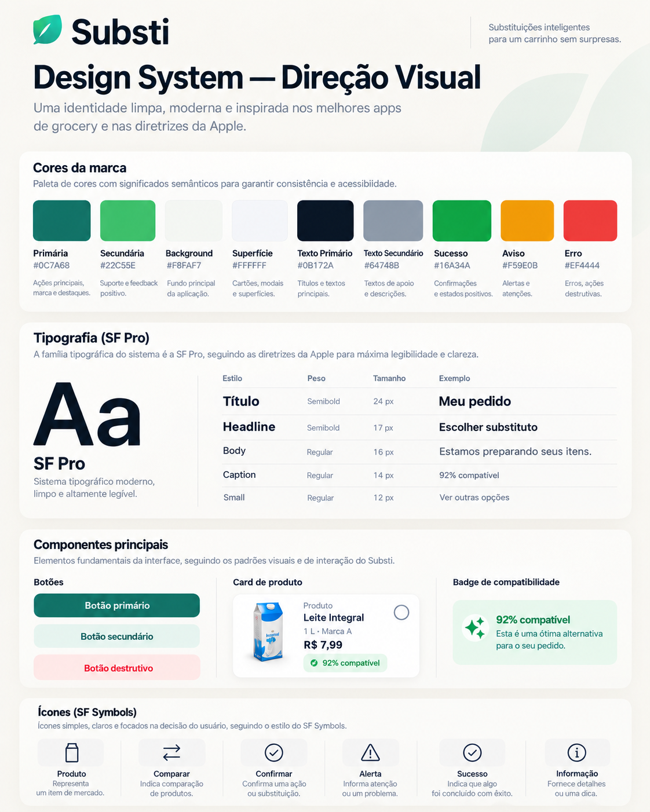

# Design System do Substi

Este documento é a fonte de verdade visual para as interfaces do Substi. Define hierarquia, foundations, componentes, reutilização, estados e requisitos de acessibilidade para UIKit e SwiftUI.

O objetivo é uma identidade própria, limpa, moderna e familiar para grocery/e-commerce, alinhada aos padrões nativos do iOS. O Substi não reproduz o design system proprietário do iFood.

## Referência visual



O painel é uma referência de direção e foundations, não uma especificação pixel-perfect das telas do produto. A interface real deve seguir os princípios e os contratos de tela descritos abaixo.

## Princípios

### CLEAR — Claro

A pessoa entende o que aconteceu, qual produto ficou indisponível, o que pode fazer e qual será o resultado da ação. Evitamos decoração e repetição sem função.

### COMPARABLE — Comparável

Produto original e substitutos apresentam informações equivalentes, na mesma ordem e com hierarquia consistente. Comparar nome, marca, quantidade, preço quando disponível, atributos relevantes e compatibilidade deve ser rápido.

### CONSISTENT — Consistente

UIKit e SwiftUI consomem a mesma linguagem visual e os mesmos tokens semânticos.

```text
Design Language → Design Tokens → UIKit
                              └──→ SwiftUI
```

### ACCESSIBLE — Acessível

Dynamic Type, VoiceOver, contraste, alvos de toque, labels e ordem lógica de leitura fazem parte da implementação inicial.

## Direção visual

```text
Clean · Premium · Grocery · Native iOS · Minimal · Friendly
```

Priorizar espaço em branco, hierarquia clara, imagem de produto relevante, CTA fácil de localizar, estados visíveis e feedback sem poluição. Evitar sombras em excesso, gradientes pesados, bordas desnecessárias, textos pequenos, cores sem semântica, componentes grandes sem necessidade e informação duplicada.

## Foundations

Os valores hexadecimais abaixo definem a paleta clara fornecida para o projeto. Tokens consumidos por Views têm nomes semânticos; hexadecimais não devem aparecer nas features. O modo escuro usa cores semânticas dinâmicas do sistema enquanto uma paleta escura própria não for especificada.

| Token | Valor claro | Uso |
| --- | --- | --- |
| `brandPrimary` | `#0C7A68` | Ações principais, marca e destaques |
| `brandSecondary` | `#22C55E` | Suporte e feedback positivo |
| `backgroundPrimary` | `#F8FAF7` | Fundo principal |
| `surfacePrimary` | `#FFFFFF` | Cards, modais e superfícies |
| `textPrimary` | `#0F172A` | Títulos e texto principal |
| `textSecondary` | `#64748B` | Texto auxiliar e descrições |
| `statusSuccess` | `#16A34A` | Confirmações e sucesso |
| `statusWarning` | `#F59E0B` | Alertas e atenção |
| `statusError` | `#EF4444` | Erros e ações destrutivas |

Também existem os tokens semânticos `brandSecondary`, `backgroundSecondary`, `surfaceSecondary`, `textInverse`, `borderDefault`, `surfaceSuccess`, `surfaceWarning`, `surfaceError`, `surfaceInformation`, `interactivePrimary` e `interactiveDisabled`. Eles devem acompanhar o papel do elemento, não expor nomes de paleta como `greenButton` ou `gray100`.

### Tipografia

Usar System Font/SF Pro com Dynamic Type. A camada de design define os estilos `largeTitle`, `title`, `headline`, `body`, `bodyEmphasized`, `caption`, `small`, `price` e `button`. Tamanhos base e pesos ficam centralizados nas foundations; features não definem fontes arbitrárias.

### Espaçamento

| Token | Pontos | Uso mental |
| --- | ---: | --- |
| `xxSmall` | 4 | Microespaço |
| `xSmall` | 8 | Elementos próximos |
| `small` | 12 | Conteúdo interno |
| `medium` | 16 | Espaçamento padrão |
| `large` | 24 | Separação de grupos |
| `xLarge` | 32 | Separação de seções |

Não introduzir valores novos sem uma necessidade de layout demonstrável.

### Raios

| Token | Pontos |
| --- | ---: |
| `small` | 8 |
| `medium` | 12 |
| `large` | 16 |

Cards usam normalmente 12–16 pontos, botões 12 e badges podem usar cápsula.

### Iconografia

Preferir SF Symbols (`checkmark.circle.fill`, `exclamationmark.circle.fill`, `info.circle`, setas, `arrow.left.arrow.right`, `xmark` e `sparkles`). Não adicionar biblioteca externa de ícones. Usar asset próprio apenas se SF Symbols não atender.

## Componentes e reutilização

Criar um componente quando uma tela precisar dele ou quando houver repetição real. Antes de criar outro, verificar se um componente existente já atende. Não duplicar cards por tela se a responsabilidade visual for a mesma.

Estrutura conceitual:

```text
DesignSystem
├── Foundations: Color, Typography, Spacing, Radius
├── UIKit: DSButton, DSProductCardView, DSStatusBadgeView,
│         DSInfoBannerView, DSLoadingView
└── SwiftUI: DSButtonStyle, DSStatusBadge,
            DSProductSummaryCard, DSComparisonRow
```

Essa lista não é uma ordem para criar tudo. Só entram componentes usados. O Design System não importa features, regras de domínio, repositories ou networking; a feature depende do Design System.

Um componente recebe dados de apresentação e renderiza. Não chama API, acessa Repository, calcula ranking nem decide navegação. Um card de produto pode receber nome, marca, quantidade, imagem ou placeholder, metadados opcionais, compatibilidade/estado e seleção.

### Estados e limite do card

Botões podem ter variantes primária, secundária e destrutiva, e estados normal, pressionado, desabilitado e carregando. Implementar somente os estados e variantes usados pelo fluxo real. O card de produto apresenta imagem, nome, marca, quantidade, metadados opcionais, compatibilidade/estado e seleção; recebe esses dados prontos e não calcula ranking.

```text
Feature → DesignSystem
DesignSystem  ↛ Feature / Repository / Networking / regras de domínio
```

## Direção nativa e acessibilidade

Preferir System Font, Dynamic Type, SF Symbols, `UINavigationController`, navigation bar, sheets nativas, gestos padrão, safe areas e cores semânticas quando adequados. Cada componente interativo precisa ter estados compreensíveis, alvos de toque adequados, label de acessibilidade e suporte a texto ampliado.

## Fluxo do produto

```text
Pedido → escolher substituto → Sugestões → selecionar candidato
       → Comparação → escolher substituto → Confirmação
       → confirmar → Pedido atualizado
```

As telas previstas são Pedido, Sugestões, Comparação e Confirmação. O fluxo acima é o objetivo completo; cada etapa será implementada quando sua task for trabalhada.

Antes de implementar cada tela, registrar propósito, objetivo da pessoa, hierarquia da informação, componentes, estados aplicáveis (`loading`, `content`, `empty`, `error`, `disabled`), ações, acessibilidade e evento de produto relevante. Consultar este documento e verificar componentes existentes antes de escrever a View.
