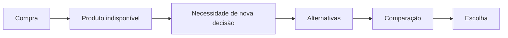

# Requisitos do produto — problema identificado

## Problema

Durante uma compra de mercado, a indisponibilidade de um produto obriga o consumidor a tomar uma nova decisão depois de já ter concluído a escolha daquele item. Se há alternativas, avaliar qual delas pode substituí-lo exige comparar características como categoria, quantidade, marca e outros atributos relevantes.

## Contexto

O problema acontece quando o produto escolhido se torna indisponível durante a jornada da compra, por exemplo durante a separação do pedido. A escolha inicial já havia sido feita; a indisponibilidade reabre essa decisão.

## Como identifiquei a oportunidade

A oportunidade surgiu ao pesquisar e analisar o cenário de compras de mercado por aplicativos: uma indisponibilidade durante a separação interrompe a jornada e pede uma nova decisão. Essa investigação inicial orienta o problema e o protótipo; não deve ser apresentada como entrevista, experimento ou validação com consumidores. As fontes e evidências ainda serão registradas na tarefa `SUB-P00-002`.

## Esforço para quem compra

O consumidor pode precisar procurar e comparar alternativas em um momento inesperado. Diferenças entre produtos podem não ser evidentes, o que pode aumentar esforço e incerteza sobre qual opção atende melhor à escolha original. A existência e a intensidade desse esforço ainda são hipóteses a validar, não resultados de pesquisa com usuários.

## Oportunidade de produto

Explorar uma forma de reduzir o esforço de decidir entre alternativas e tornar a substituição mais compreensível para o consumidor.

## Direção proposta

Apresentar alternativas compatíveis e tornar explícitos os motivos pelos quais cada uma pode substituir o produto original, destacando informações comparáveis como categoria, quantidade, marca e outros atributos pertinentes. Esta é uma direção de produto; arquitetura e implementação ainda não estão definidas aqui.

## Valor esperado para a pessoa usuária

Esperamos que o consumidor consiga avaliar alternativas com menos esforço, entenda melhor as diferenças e tenha mais confiança e controle ao decidir.

## Hipótese de valor para o negócio

Uma experiência de substituição mais clara poderia influenciar a aceitação de substituições, cancelamentos de itens indisponíveis e o tempo até a decisão. São resultados possíveis a medir; não há números, resultados observados ou promessa de impacto neste documento.

## Hipóteses

- Consumidores podem preferir avaliar uma alternativa adequada em vez de decidir sem comparação; isso precisa ser validado.
- Categoria, quantidade, marca e outros atributos podem ajudar o consumidor a avaliar compatibilidade; a importância relativa pode variar.
- Podem existir alternativas disponíveis, mas a disponibilidade depende do contexto da compra e não é presumida para todos os casos.
- As informações de produto disponíveis podem ser suficientes para explicar algumas diferenças; cobertura e qualidade ainda precisam ser verificadas.

## O que não estamos afirmando

- Este projeto não afirma que o iFood não oferece substituições, nem faz alegações sobre a funcionalidade atual do iFood.
- Este documento não apresenta pesquisa de usuários, comportamento observado ou evidência quantitativa.
- Não afirmamos que a proposta necessariamente aumentará aceitação, reduzirá cancelamentos ou diminuirá o tempo de decisão.
- Não presumimos que uma fonte pública de informações de produtos represente estoque ou disponibilidade de uma loja.

## Hipótese do produto

> Para uma pessoa que compra mercado por aplicativo e descobre que um item escolhido está indisponível, apresentar alternativas compatíveis com os motivos da comparação poderá ajudá-la a escolher um substituto com menos esforço do que reiniciar a busca. Essa hipótese parte da análise exploratória do problema e ainda precisa ser validada com pessoas usuárias.

### Sinais que podem ajudar a validar a hipótese

- A pessoa consegue escolher uma alternativa no fluxo proposto sem reiniciar a busca pelo produto.
- A pessoa consegue explicar por que a alternativa foi apresentada e quais diferenças influenciaram sua escolha.
- Em uma avaliação com pessoas usuárias, a pessoa relata quanto esforço e confiança sentiu ao comparar as opções.

Esses sinais orientam uma avaliação futura; não são resultados já observados nem metas quantitativas definidas. Tempo de decisão pode ser medido em um teste quando houver um protocolo adequado, mas, sozinho, não demonstra que a experiência causou uma melhora.

### Hipótese de valor para o negócio

Se a experiência ajudar consumidores a escolher substitutos adequados, ela poderá influenciar a aceitação de substituições e a conclusão de compras com itens indisponíveis. O protótipo não representa uma operação de loja e não permite afirmar ou medir esse impacto. Seriam necessários dados de uma operação real e uma avaliação apropriada.

### Limites atuais

- Ainda não há entrevistas, testes de usabilidade ou dados quantitativos de pessoas usuárias.
- Não foram definidos valores-alvo para esforço, confiança, tempo ou aceitação de substituições.
- A hipótese não pressupõe que toda indisponibilidade tenha uma alternativa adequada nem que informações públicas representem o estoque da loja.

## Jornada do problema

