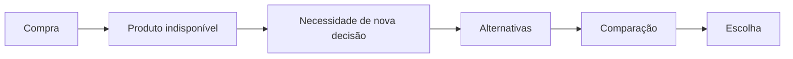

# Product Requirements — Product Problem

## Problem

Durante uma compra de mercado, a indisponibilidade de um produto obriga o consumidor a tomar uma nova decisão depois de já ter concluído a escolha daquele item. Se há alternativas, avaliar qual delas pode substituí-lo exige comparar características como categoria, quantidade, marca e outros atributos relevantes.

## Context

O problema acontece quando o produto escolhido se torna indisponível durante a jornada da compra, por exemplo durante a separação do pedido. A escolha inicial já havia sido feita; a indisponibilidade reabre essa decisão.

## User Pain

O consumidor pode precisar procurar e comparar alternativas em um momento inesperado. Diferenças entre produtos podem não ser evidentes, o que pode aumentar esforço e incerteza sobre qual opção atende melhor à escolha original. A existência e a intensidade desse esforço ainda são hipóteses a validar, não resultados de pesquisa com usuários.

## Product Opportunity

Explorar uma forma de reduzir o esforço de decidir entre alternativas e tornar a substituição mais compreensível para o consumidor.

## Proposed Direction

Apresentar alternativas compatíveis e tornar explícitos os motivos pelos quais cada uma pode substituir o produto original, destacando informações comparáveis como categoria, quantidade, marca e outros atributos pertinentes. Esta é uma direção de produto; arquitetura e implementação ainda não estão definidas aqui.

## Expected User Value

Esperamos que o consumidor consiga avaliar alternativas com menos esforço, entenda melhor as diferenças e tenha mais confiança e controle ao decidir.

## Business Value Hypothesis

Uma experiência de substituição mais clara poderia influenciar a aceitação de substituições, cancelamentos de itens indisponíveis e o tempo até a decisão. São resultados possíveis a medir; não há números, resultados observados ou promessa de impacto neste documento.

## Assumptions

- Consumidores podem preferir avaliar uma alternativa adequada em vez de decidir sem comparação; isso precisa ser validado.
- Categoria, quantidade, marca e outros atributos podem ajudar o consumidor a avaliar compatibilidade; a importância relativa pode variar.
- Podem existir alternativas disponíveis, mas a disponibilidade depende do contexto da compra e não é presumida para todos os casos.
- As informações de produto disponíveis podem ser suficientes para explicar algumas diferenças; cobertura e qualidade ainda precisam ser verificadas.

## Non-Claims

- Este projeto não afirma que o iFood não oferece substituições, nem faz alegações sobre a funcionalidade atual do iFood.
- Este documento não apresenta pesquisa de usuários, comportamento observado ou evidência quantitativa.
- Não afirmamos que a proposta necessariamente aumentará aceitação, reduzirá cancelamentos ou diminuirá o tempo de decisão.
- Não presumimos que uma fonte pública de informações de produtos represente estoque ou disponibilidade de uma loja.

## Jornada do problema

